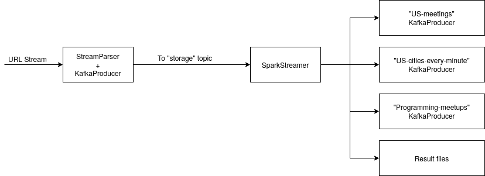

# HomeWork4

## Simple diagram

### All my system consist of two parts:
1. Generator (read URL stream and send it to Kafka topic called "storage")
2. Consumer (read "storage" and process using Spark Streaming and write to corresponding topic)

### Generator 

#### How to use
1. Install this sources with all dependencies. (they are all described in pom.xml)
2. Create kafka topic called storage.
3. Run Generator.main and it will write messages to storage.

### Consumer 

#### How to use
1. Install this sources with all dependencies. (they are all described in pom.xml)
2. Create kafka topic called storage.
3. Create kafka topics "US-meetups","US-cities-every-minute","Programming-meetups"
4. Run StreamProcessingUsingSparkMain.main

#### What consumer do?

It will read "storage" topic then produce messages to corresponding kafka topics. Also during that it will create results files. But their format is not accurate JSON. Thats why you need to run **manipulate_results.sh** to get JSON results in results folder.

### Examples of results
Example of all results can be found in results folder.
Link to s3 bucket
https://s3.console.aws.amazon.com/s3/buckets/kafka-aws-load-bucket/homework4
